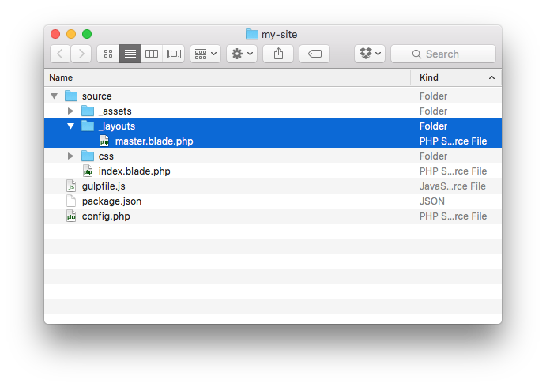
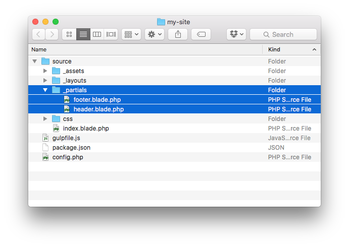

## Blade Templates & Partials

One of the biggest benefits of a templating language is the ability to create reusable layouts and partials. Jigsaw gives you access to all the templating features and control structures of Blade that are available in Laravel 5.4 (learn more about Blade layouts in the [official Blade documentation](https://laravel.com/docs/5.4/blade)).

### Defining a Layout

Layouts themselves are just basic Blade templates that have one or more `@yield` calls where child templates can render their contents.

A basic master layout could look like this:

```
<!DOCTYPE html>
<html>
    <head>
        <title>The Amazing Web</title>
    </head>
    <body>
        <header>
            My Amazing Site
        </header>

        @yield('contents')

        <footer>
            <p>©2016 Awesome Co</p>
        </footer>
    </body>
</html>
```

Jigsaw provides a `source/_layouts` directory out of the box with a basic master layout.

### Extending a Layout

To extend a layout, create a template that specifies which layout to extend in an `@extends` directive, and which section(s) to populate using the `@section` directive:

```
@extends('_layouts.master')

@section('contents')

<div>
    <p>The contents of my amazing homepage.</p>
</div>

@endsection
```

Layouts and partials are referenced relative to the `source` directory using _dot notation_, where each dot represents a directory separator in the file name and the `.blade.php` extension omitted.

### Partials

To include a template inside of another template, use the `@include` directive:

```
<!DOCTYPE html>
<html>
    <head>
        <title>The Amazing Web</title>
    </head>
    <body>
        @include('_partials.header')

        @yield('contents')

        @include('_partials.footer')
    </body>
</html>
```

You can pass data to a partial by passing an associative array as a second parameter:

```
<!DOCTYPE html>
<html>
    <head>
        <title>The Amazing Web</title>
    </head>
    <body>
        @include('_partials.header', ['page_title' => 'My Amazing Site'])

        @yield('contents')

        @include('_partials.footer')
    </body>
</html>
```

That data is then available in your partial as a normal variable:

```
<!-- _partials/header.blade.php -->
<header>
    {{ $page_title }}
</header>
```

### Preventing Layouts & Partials from Rendering

Since it's important that layouts and partials are never rendered on their own, you need to be able to tell Jigsaw when a file shouldn't be rendered.

To prevent a file or folder from being rendered, simply prefix it with an underscore:



Jigsaw gives you a `_layouts` folder by default, but as long as you prefix with an underscore, you can create any files or folders you need.

For example, if you wanted a place to store all of your partials, you could create a directory called `_partials`:



Since the `_partials` folder starts with an underscore, those files won't be rendered when you generate your site, but will still be available to `@include` in your other templates.

### Laravel Mix Versioning

If you are using Laravel Mix's versioning feature, which is enabled in the default Jigsaw configuration, you can now use the global `mix()` helper function to load the appropriate asset into your views. Simply pass it a path to one of your assets (with the normal filename) and the `mix()` function will automatically determine the current versioned name of the file.

For example, in the head of your master layout file:

```
<link rel="stylesheet" href="{{ mix('/css/main.css') }}">
```
