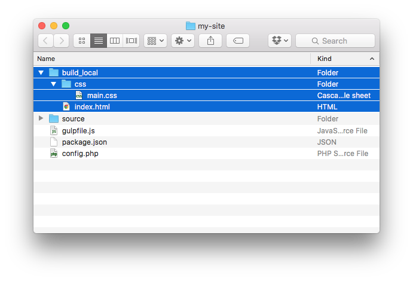

## Building & Previewing

When you'd like to generate your site, run the `build` command from within your project root:

`$ ./vendor/bin/jigsaw build`

Jigsaw will generate your static HTML and place it in the `./build_local` directory by default.

Using the default site structure, `./build_local` will look like this:



### Previewing with PHP

To quickly preview your site, use the `serve` command:

`$ ./vendor/bin/jigsaw serve`

You can now view your site at `http://localhost:8000` in your browser.

You can also optionally specify the environment and port to serve like so:

`$ ./vendor/bin/jigsaw serve production --port=8080`

This will serve your `build_production` folder at `http://localhost:8080`.

### Previewing with Browsersync

If you are [using Laravel Mix to compile your assets](../compiling-assets), you can preview your site with Browsersync by simply running:

```
$ npm run watch
```

Browsersync will automatically open a new browser tab and reload the page every time you make a change. Very helpful for previewing your changes quickly!
