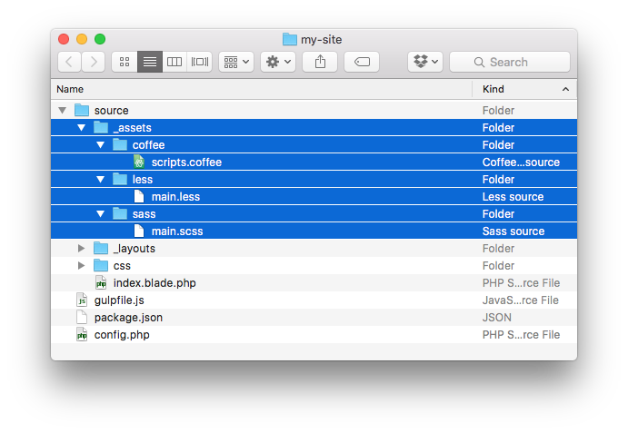
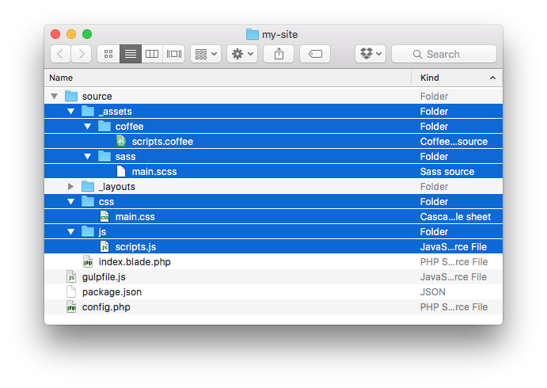

## Compiling Assets

Jigsaw sites are configured with support for [Laravel Mix](https://github.com/JeffreyWay/laravel-mix) out of the box. If you've ever used Mix in a Laravel project, you already know how to use Mix with Jigsaw.

### Setup

To get started, first make sure you have Node.js and NPM installed in your environment.

Once you have Node.js and NPM installed, pull in the dependencies needed to compile your assets:

```
$ npm install
```

For more detailed installation instructions, check out the [full Laravel Mix documentation](https://github.com/JeffreyWay/laravel-mix).

### Organizing your assets

By default, any assets you want to process with Mix should live in `source/_assets`:



Mix looks for each asset type _(like Sass, Less, or Coffeescript)_ in a subfolder named after that asset type. We recommend following this convention to avoid additional configuration.

By default, once your assets are compiled, they will be placed in their corresponding directories, directly under the `source` folder:



If you'd like to change the source and destination folders for your assets, edit the following lines in `webpack.mix.js`:

```js
mix.setPublicPath('source/assets/');

mix.js('source/_assets/js/main.js', 'js/')
    .sass('source/_assets/sass/main.scss', 'css/')
```

### Enabling different preprocessors

Jigsaw ships with the following `webpack.mix.js` and is configured to use Sass out of the box:

```js
let argv = require('yargs').argv;
let command = require('node-cmd');
let jigsaw = require('./tasks/bin');
let mix = require('laravel-mix');

let AfterBuild = require('on-build-webpack');
let BrowserSync = require('browser-sync');
let BrowserSyncPlugin = require('browser-sync-webpack-plugin');
let Watch = require('webpack-watch');

const env = argv.e || argv.env || 'local';
const port = argv.p || argv.port || 3000;
const buildPath = 'build_' + env + '/';

let browserSyncInstance;

let plugins = [
    new AfterBuild(() => {
        command.get(jigsaw.path() + ' build ' + env, (error, stdout, stderr) => {
            console.log(error ? stderr : stdout);

            if (browserSyncInstance) {
                browserSyncInstance.reload();
            }
        });
    }),

    new BrowserSyncPlugin({
        proxy: null,
        port: port,
        server: { baseDir: buildPath },
        notify: false,
    },
    {
        reload: false,
        callback: function() {
            browserSyncInstance = BrowserSync.get('bs-webpack-plugin');
        },
    }),

    new Watch({
        paths: ['source/**/*.md', 'source/**/*.php'],
        options: { ignoreInitial: true }
    }),
];

mix.webpackConfig({ plugins });
mix.disableSuccessNotifications();
mix.setPublicPath('source/assets/');

mix.js('source/_assets/js/main.js', 'js/')
    .sass('source/_assets/sass/main.scss', 'css/')
    .version();
```

If you'd like to switch to Less, use Coffeescript, or take advantage of any other Mix features, feel free to edit this file to your heart's content. For most applications, only the last six lines of the `webpack.mix.js` file will need to be altered, so we will only show those in the following examples.

Here's an example of what it might look like to use Less and React:

```js
mix.webpackConfig({ plugins });
mix.disableSuccessNotifications();
mix.setPublicPath('source/assets/');

mix.react('source/_assets/js/main.js', 'js/')
    .less('source/_assets/sass/main.scss', 'css/')
    .version();
```

### Compiling your assets

To compile your assets, run:

```
$ npm run dev
```

Once the assets have been compiled, the `build` command will be run again automatically, so you can preview your changes in the browser.

### Watching for changes

Manually running `npm run dev` every time you make a change gets old pretty fast.

Instead, you can run the following command to watch your project for changes:

```
$ npm run watch
```

Any time any file changes in your project, your assets will be recompiled and Jigsaw will regenerate your static HTML pages.

Using `npm run watch` also enables [Browsersync](https://www.browsersync.io/), so your browser will automatically reload any time you make a change. It also manages serving your site locally for you, so you don't need to start your own local PHP server.

You can also watch a specific environment by running `npm run local`, `npm run staging`, or `npm run production`.
