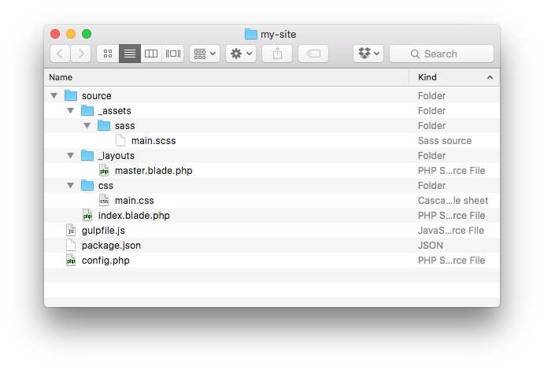

## Starting a New Site

The fastest way to start a new Jigsaw site is to use the built-in `init` command to scaffold the default directory structure.

If you have Jigsaw installed globally, simply run:

```
$ jigsaw init my-site
```

This will scaffold a new Jigsaw site in a new folder called `my-site` in the current directory.

If you've already created a folder for your site and installed Jigsaw local to that folder with Composer, run:

```
$ jigsaw init
```

This will scaffold a new Jigsaw site in the current directory.

### Directory structure

By default, Jigsaw gives you the following directory structure:



The `source` directory contains the actual contents of your site. This is where all of your sites pages, CSS, Javascript, images, etc. will be kept.

At the root of the directory, Jigsaw provides `webpack.mix.js` and `package.json` for compiling your assets, and a `config.php` file where you can specify variables to be made available in your templates.

Next, learn about [building and previewing your site](../building-and-previewing).
